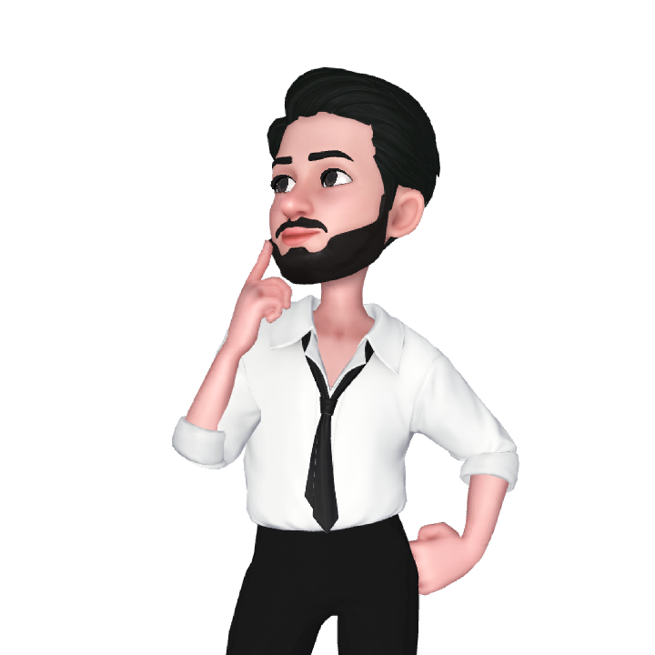

## Hi I'm Alireza 

### I'm a junior FrontEnd developer and Software Engineer

> 👀 I’m 22 years old and Computer Engineering student interested in the web world. 
> I work as a FrontEnd developer and I have various activities in this field I started in 2020. 
> I have a serious passion for learning new things and creating better user interface experiences. 
>  Fast load times and lag free interaction , writing clean and efficient code are my highest priorities. 

<!-- #### - 📫 You can reach me on: [Linkedin](https://www.linkedin.com/in/alireza-gholizadeh) , [Instagram](https://www.instagram.com/Alirzagz) , [Telegram](https://www.t.me/alirzagz) , [Gmail](mailto:alireza.niceee@gmail.com) . -->

 

## ⚡ Tech Stack

#### Languages, Frameworks, Platforms and Libraries:  

#### Tools :  

#### Other:  

	
  
<b>⚡ Github Stats</b>

   
  
  

 <b>📫 Contact me </b>

  

